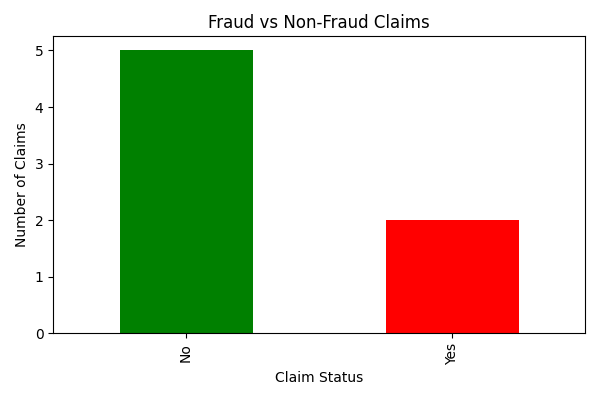
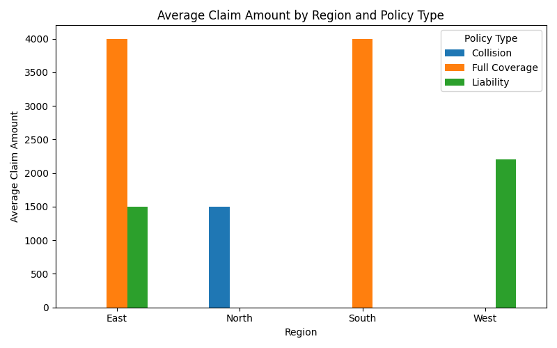
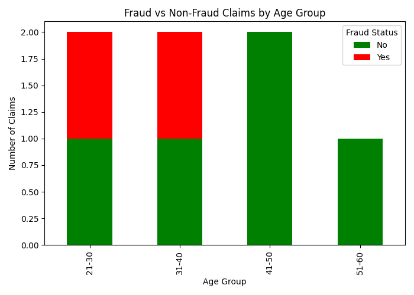
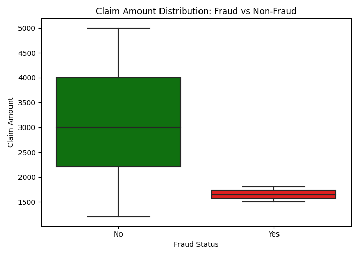

# 🛡️ Insurance Claims Fraud & Risk Detection API

A Flask-based data analysis and REST API project that helps detect fraud and assess risk in insurance claims using real-world patterns and visualizations.


## 🚀 Features

- 📊 Analyzes insurance claim data for patterns and fraud detection
- 🧠 Insights based on region, policy type, and age group
- 📈 Auto-generated visualizations (boxplots, bar graphs, heatmaps)
- 🌐 Flask REST API with JSON endpoints
- 🖼️ Simple frontend dashboard to display graphs


## 🗂️ Project Structure
<pre>```
insurance-claims-fraud-risk-api/
│
├── app.py  # Main Flask app
├── requirements.txt  # Python dependencies
├── README.md  # This file
│
├── analysis/
│ └── analysis.py  # All data processing and plotting
│
├── data/
│ └── dataset.csv  # Input insurance claims dataset
│
├── static/
│ └── plots/  # Output graphs
│ ├── fraud_vs_nonfraud.png
│ ├── avg_claim_by_region_policy.png
│ ├── fraud_by_age_group.png
│ └── claim_amount_fraud_boxplot.png
│
└── templates/
└── index.html  # Frontend dashboard

```</pre>

### ⚙️ Setup Instructions
  ## Steps
    ```bash
     # Create and activate virtual environment
       python3 -m venv venv
       source venv/bin/activate        # fro Mac

     # Install dependencies
     pip install -r requirements.txt
     
## Prerequisites
- Python 3.8+  
- Virtual environment (recommended)

## Running the Application
python app.py

## Usage
- Open your browser and navigate to the dashboard:
http://127.0.0.1:5000/
- API Endpoints:
Average claim by region and policy type: http://127.0.0.1:5000/api/average-claim
Fraud claim counts by age group: http://127.0.0.1:5000/api/fraud-count
- View generated plots directly:
http://127.0.0.1:5000/plots/fraud_vs_nonfraud.png
http://127.0.0.1:5000/plots/avg_claim_by_region_policy.png
http://127.0.0.1:5000/plots/fraud_by_age_group.png
http://127.0.0.1:5000/plots/claim_amount_fraud_boxplot.png

# Insights
- Fraudulent claims vary by age groups and policy types
- Average claim amounts differ significantly across regions
- Visualization of claim amount distributions help identify fraud risk

# Technologies Used
- Python 3
- Flask (REST API)
- Pandas (data manipulation)
- Matplotlib & Seaborn (data visualization)

# Screenshots
### Fraud vs Non-Fraud Claims  


### Average Claim by Region and Policy  


### Fraud by Age Group  


### Claim Amount Boxplot  



Varsha Shabolu
Github profile: https://github.com/varshashabolu
